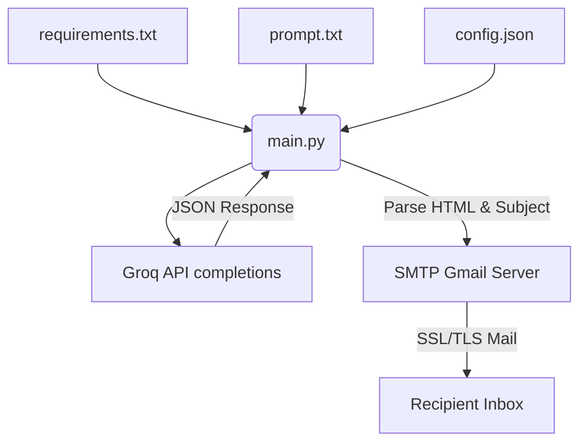
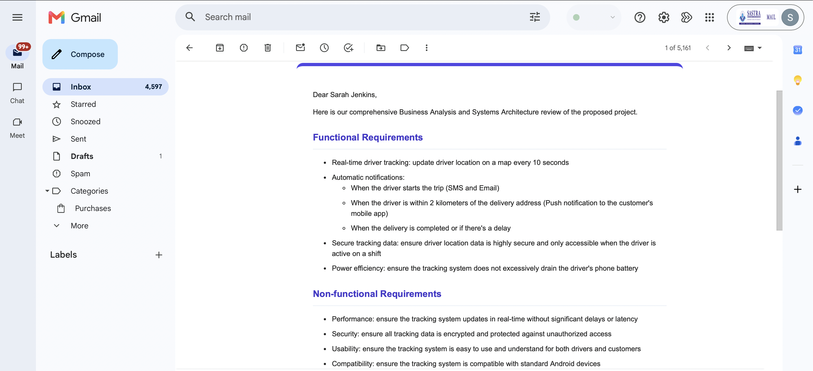
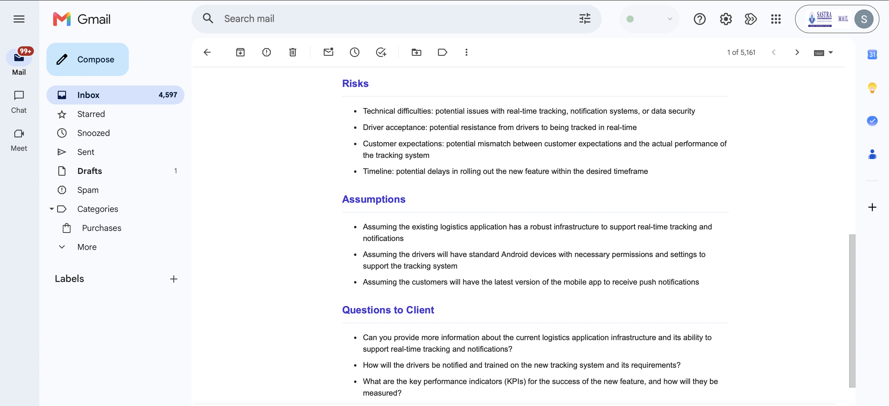
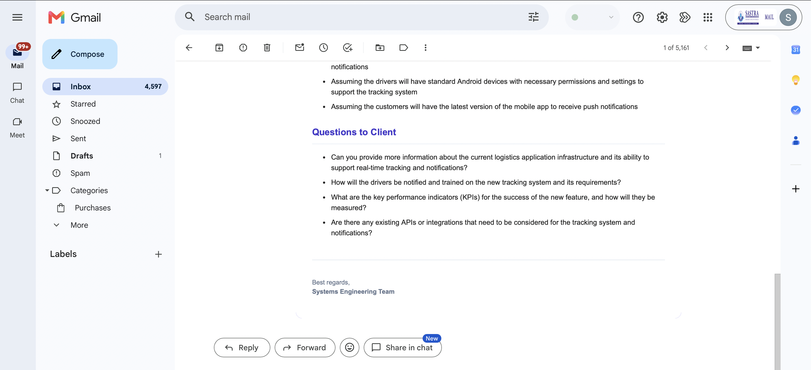

# Client Requirements Analyzer & Email Automation

This utility automates the analysis of software requirement requests from clients. It leverages the Groq API (e.g., Llama-3.3) to dissect client emails into structured functional/non-functional requirements, risks, assumptions, and client questions, formats the output as a premium HTML email, and sends it directly to a recipient Gmail account.

## System Architecture



### Flow Walkthrough
1. **Configuration Ingestion**: The program reads config keys dynamically from `config.json`, checking and normalizing kebab-case and snake_case parameters.
2. **Context Compilation**: Reads input documents `requirements.txt` (client email) and `prompt.txt` (system instruction guidelines).
3. **API Analytics**: Dispatches completions requests to the Groq Llama-3.3 API with custom network timeouts.
4. **HTML Content Parsing**: Isolates the subject header and HTML block components from the API response text.
5. **Secure Dispatch**: Initializes context-managed secure TLS or SSL SMTP server protocols and sends the final report.

## Setup Instructions

1. **Prerequisites**:
   Ensure you have Python 3 installed. You will need the `requests` library:
   ```bash
   pip install requests
   ```
   Or using the local project environment:
   ```bash
   ./myenv/bin/pip install requests
   ```

2. **Configure Credentials**:
   Create a file named `config.json` (you can copy `config.json.template`) and update it with:
   - `GROQ_API_KEY`: Your API key from Groq Console.
   - `SENDER_EMAIL`: The Gmail address that will send the email.
   - `SENDER_PASSWORD`: Your Gmail **App Password** (Not your regular password. Go to Google Account -> Security -> 2-Step Verification -> App Passwords).
   - `RECIPIENT_EMAIL`: The destination email address.

3. **Run the Script**:
   ```bash
   ./myenv/bin/python main.py
   ```

## Deliverables Reference

This project is structured to directly map to the participants' deliverables:

- **Prompt used**: Located in [prompt.txt](AI_Agent/prompt.txt)
- **Python Script**: Located in [main.py](AI_Agent/main.py)
- **Sample Input**: Located in [requirements.txt](AI_Agent/requirements.txt)
- **Sample Output**: Generated at [output_analysis.html](AI_Agent/output_analysis.html) and `output_raw_response.txt` after running the script.
- **Architecture Diagram**: Rendered above in this README.

## Outputs


---


---


---
