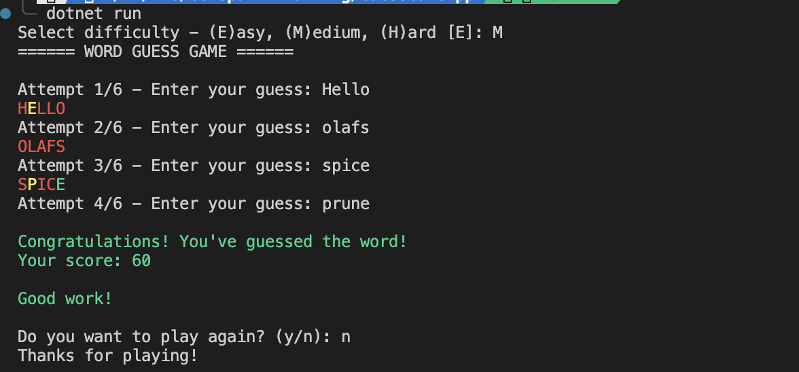

# Word Guessing Game (C# Console Application)

A database-backed console word guessing game inspired by Wordle. Features user authentication, persistent player statistics, and game history tracking.

---

## Features

### Core Gameplay
- Random word selection from database across 3 difficulty levels (Easy, Medium, Hard)
- Maximum of 6 attempts per game
- Real-time feedback system:
  - `G` → Correct letter in correct position
  - `Y` → Correct letter in wrong position
  - `X` → Letter not present
- Input validation with custom exception handling
- Prevents duplicate guesses per game
- Colored console output for better UX
- Replay option without re-authentication

### User & Persistence
- **User Authentication**: Login/Register system with PostgreSQL backend
- **Game History**: Every game persisted to database with timestamp
- **Player Statistics**: Automatic aggregation of:
  - Total games played
  - Total wins
  - Best score achieved
  - Total score accumulated
  - Last game update timestamp
- Unique usernames enforced at DB level

### Scoring System
- Score calculation based on attempts:
  - 1-2 attempts: 100 points
  - 3 attempts: 80 points
  - 4 attempts: 60 points
  - 5 attempts: 40 points
  - 6 attempts: 20 points
  - Loss: 0 points

---

## Technologies Used

- **C# 12** (.NET 10.0)
- **PostgreSQL** database with Npgsql driver
- Object-Oriented Programming (OOP)
- Repository Pattern for data access
- Exception Handling
- Collections (`HashSet`)
- Regex Validation

---

## Database Schema

### `users` Table
```sql
id (SERIAL PRIMARY KEY)
username (VARCHAR(255) UNIQUE NOT NULL)
password (VARCHAR(255) NOT NULL)
created_at (TIMESTAMP DEFAULT CURRENT_TIMESTAMP)
```

### `games` Table
```sql
id (SERIAL PRIMARY KEY)
user_id (INTEGER FK → users.id)
difficulty_lvl (VARCHAR(50) NOT NULL)
attempts (INTEGER NOT NULL)
is_won (BOOLEAN NOT NULL)
score (INTEGER NOT NULL)
created_at (TIMESTAMP DEFAULT CURRENT_TIMESTAMP)
```

### `player_stats` Table
```sql
user_id (INTEGER PK FK → users.id)
total_games (INTEGER DEFAULT 0)
total_wins (INTEGER DEFAULT 0)
best_score (INTEGER DEFAULT 0)
total_score (INTEGER DEFAULT 0)
updated_at (TIMESTAMP DEFAULT CURRENT_TIMESTAMP)
```

### `words` Table
```sql
id (SERIAL PRIMARY KEY)
word (VARCHAR(255) NOT NULL)
difficulty (VARCHAR(50) NOT NULL)
```
- Pre-seeded with 21 words (7 Easy, 7 Medium, 7 Hard)
- Auto-populated on first run

---

## Setup & Prerequisites

### Database Configuration

Update connection string in [Data/DbConnectionFactory.cs](Data/DbConnectionFactory.cs):
```csharp
private static readonly string connectionString = 
    "Host=localhost;Username=postgres;Password=YOUR_PASSWORD;Database=guessgame";
```

Create the database:
```bash
createdb guessgame
```

### Build & Run

```bash
dotnet restore
dotnet build
dotnet run
```

On first run, the application automatically initializes all required tables.

---

## How to Use

1. **Register** a new account or **Login** with existing credentials
2. **Select difficulty** (Easy/Medium/Hard) — defaults to Easy
3. **Make guesses** within 6 attempts
4. **View feedback** after each guess (G/Y/X format)
5. **Play again** or exit

All games are automatically saved to the database.

---

## Project Structure

| Folder/File           | Purpose                                      |
| --------------------- | -------------------------------------------- |
| `Data/`               | Database initialization & connection factory |
| `Models/`             | `User`, `Game` domain models                |
| `Repositories/`       | `UserRepository`, `GameSessionRepository`   |
| `Services/`           | Game logic: `WordProvider`, `ScoreCalculator`, `GuessValidator`, `FeedbackGenerator` |
| `Interfaces/`         | Repository contracts                        |
| `Main/`               | `GuessGame` main game loop                  |
| `Helpers/`            | Console output, validation helpers          |
| `Exceptions/`         | Custom `InvalidGuessException`              |

---

## OOP Concepts Implemented

| Class                      | Responsibility                              |
| -------------------------- | ------------------------------------------- |
| `GuessGame`                | Game flow & turn orchestration              |
| `UserRepository`           | User login/registration persistence         |
| `GameSessionRepository`    | Game history & player stats aggregation    |
| `WordProvider`             | Random word selection by difficulty        |
| `GuessValidator`           | Input validation (length, characters)      |
| `FeedbackGenerator`        | G/Y/X feedback logic                        |
| `ScoreCalculator`          | Score computation from attempts             |
| `ConsoleCommenter`         | Colored console output                      |
| `InvalidGuessException`    | Custom validation exception                 |

---

## Exception Handling

The application validates and handles:
- Empty input
- Input length != 5 letters
- Numbers in input
- Special characters in input
- Duplicate guesses within same game
- Database connection errors (gracefully logged)
- Duplicate username registration attempts

---

## Output Screenshot




---