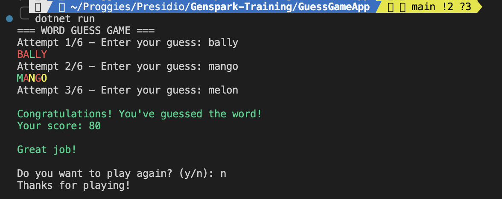

# Word Guessing Game (C# Console Application)

A console-based word guessing game inspired by Wordle, built using C#, Object-Oriented Programming (OOP), and Exception Handling.

---

## Features

- Random 5-letter hidden word
- Maximum of 6 attempts
- Feedback system using:
  - `G` → Correct letter in correct position
  - `Y` → Correct letter in wrong position
  - `X` → Letter not present
- Input validation using custom exceptions
- Prevents duplicate guesses
- Colored console output
- Replay option
- Score calculation

---

## Technologies Used

- C#
- .NET Console Application
- OOP Concepts
- Exception Handling
- Collections (`HashSet`, `Dictionary`)
- Regex Validation

---

## Exception Handling

The application handles:

* Empty input
* Input less than 5 letters
* Input greater than 5 letters
* Numbers in input
* Special characters
* Duplicate guesses

---

## How to Run

### Using .NET CLI

```bash
dotnet run
```

### Build Project

```bash
dotnet build
```

---

## Output Screenshot



---

## OOP Concepts Implemented

| Class                   | Responsibility            |
| ----------------------- | ------------------------- |
| `Game`                  | Controls game flow        |
| `WordProvider`          | Provides random words     |
| `GuessValidator`        | Validates user input      |
| `FeedbackGenerator`     | Generates G/Y/X feedback  |
| `InvalidGuessException` | Custom exception handling |
| `ScoreManager`          | Calculates score          |

---
