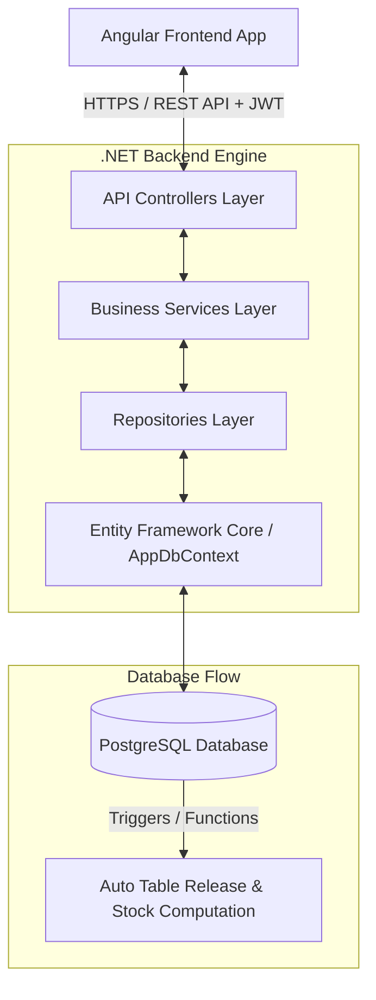

# System Architecture

This document describes the high-level system architecture of the **Order & Kitchen Management System**.

## 1. System Overview

The application follows a decoupled client-server architecture:
* **Frontend**: A modern Single Page Application (SPA) built using **Angular**, responsible for the user interface, routing, auth guards, and consumption of RESTful APIs.
* **Backend**: A RESTful Web API built with **.NET Core 9**, exposing endpoints, executing business validations, mapping database entities, and generating reports.
* **Database**: **PostgreSQL** (production/development) and **InMemory/SQLite** (testing/local prototyping), managed via Entity Framework Core. Database-level constraints and triggers handle cascading status changes and stock inventory computations.

---

## 2. Backend Layered Architecture (.NET Core API)

The backend follows the clean Repository-Service pattern:

### A. Presentation Layer (Controllers)
* Located in `Controllers/`.
* Exposes JSON endpoints via ASP.NET Core controllers inheriting from `ControllerBase`.
* Attaches `[Authorize]` attributes and JWT authorization policies to endpoints.
* Handles request routing, model validation, and logging via `Microsoft.Extensions.Logging`.

### B. Business Logic Layer (Services)
* Located in `Services/` (Interfaces defined in `Services/Interfaces/`).
* Orchestrates business rules (e.g., deducting stock when orders are placed, validating quantities, generating PDF invoices).
* Performs transactional handling via EF Core transactions (`BeginTransactionAsync`).
* Uses DTO classes (`Models/DTOs/`) to accept client input and shape client output, preventing direct exposure of EF database entities.

### C. Data Access Layer (Repositories)
* Located in `Repositories/` (Interfaces defined in `Repositories/Interfaces/`).
* Direct query interfaces utilizing Entity Framework Core.
* Isolates Entity framework-specific queries from the business service layer.

### D. Data Modeling and Schema (DbContext & Entities)
* **Entities**: Located in `Models/Entities/` (inheriting from `BaseEntity` for `CreatedAt` and `UpdatedAt` auditing fields).
* **AppDbContext**: Located in `Data/AppDbContext.cs`. Details schema relationships, delete configurations (e.g., cascading order items, restricting deletes on used tables/categories), indexes, and model seed data.

---

## 3. Authentication & Authorization Flow

The backend handles security using custom JWT (JSON Web Tokens) claims and claims-based policies:

### User Roles
The system defines four distinct user roles (managed via seed data in `Roles`):
1. **Admin**: Has complete control over tables, categories, menu items, users, inventory items, and billing records.
2. **Customer**: Authenticated registered users who can place orders and monitor their table session.
3. **Chef**: Kitchen staff responsible for viewing active order queues, marking orders as cooking (`InPrep`), and complete (`Ready`).
4. **Deliveryman**: Responsible for delivering served or takeaway orders.

### Guest Session Flow
To facilitate order placement without requiring traditional signups (e.g., when dining in-house):
* **Guest Token**: Initiated by POST `/api/auth/guest-login?tableId=X`.
* Generates a short-lived JWT containing:
  * `"tableId": "X"`
  * `"SessionType": "Guest"`
* Authenticated endpoints use `ClaimsPrincipalExtensions.GetTableId()` to extract table IDs directly from claims, ensuring guest requests are securely linked to their physical table.

### Authorization Policies
Defined in [Program.cs](file:///Users/sarveswaranb/Proggies/Presidio/Genspark-Training/OrderNKitchenMS-Engine/OrderNKitchenMS-API/Program.cs):
* `AdminOnly`: Requires role `Admin`.
* `ChefOnly`: Requires role `Chef`.
* `AdminOrChef`: Requires role `Admin` or `Chef`.
* `CustomerOnly`: Requires role `Customer`.
* `DeliverymanOnly`: Requires role `Deliveryman`.
* `GuestSession`: Requires claim `SessionType` with value `Guest`.
* `CanPlaceOrder`: Assertive policy allowing either **Guest Session** (has table ID), **Admin**, or **Customer** to create and edit orders.

---

## 4. Cross-Cutting Concerns

### A. Logging
* Utilizes **Serilog** configured in `appsettings.json`.
* Outputs daily rolling logs under `Logs/log-.txt`.
* Standard template formats timestamps, log levels, messages, and stack traces.

### B. Global Exception Handling
* Implemented via a `GlobalExceptionHandler` middleware inheriting from `IExceptionHandler` (registered in [Program.cs](file:///Users/sarveswaranb/Proggies/Presidio/Genspark-Training/OrderNKitchenMS-Engine/OrderNKitchenMS-API/Program.cs)).
* Catches all exceptions thrown in controllers or services and normalizes them into RFC-7807 Problem Details JSON format:
  * `NotFoundException` $\rightarrow$ `404 Not Found`
  * `ConflictException` $\rightarrow$ `409 Conflict`
  * `ForbiddenException` $\rightarrow$ `403 Forbidden`
  * `UnauthorizedException` $\rightarrow$ `401 Unauthorized`
  * `BusinessRuleException` $\rightarrow$ `400 Bad Request`
  * General uncaught exceptions $\rightarrow$ `500 Internal Server Error`

### C. PDF Generation
* Utilizes **QuestPDF** library (Community License) for document generation.
* The utility [PdfGenerator.cs](file:///Users/sarveswaranb/Proggies/Presidio/Genspark-Training/OrderNKitchenMS-Engine/OrderNKitchenMS-API/Utils/PdfGenerator.cs) styles, designs, and builds clean invoices detailing order items, tax rates, discounts, sub-totals, and final totals.
