# Database Flow (Triggers and Functions)

This document describes the database-level triggers and functions that orchestrate automatic state changes, inventory deductions/restocking, table status releases, and menu item availability calculations.

---

## 1. Triggers Overview

The system uses **PostgreSQL triggers** to ensure data integrity, maintain audit columns, and run real-time availability logic directly in the data layer.

```mermaid
graph TD
    subgraph Update Triggers
        A[Any Table Update] -->|trg_..._UpdatedAt| B[update_updated_at_column]
        B -->|Set| C[UpdatedAt = NOW]
    end

    subgraph Order Release Trigger
        D[Order Status -> 5 or 6] -->|trg_Orders_ReleaseTable| E[trg_fn_release_table_on_order_complete]
        E -->|Update Table Status| F[Table Status = 1 Available]
    end

    subgraph Inventory Availability Engine
        G[Items Table Insert/Update/Delete] -->|trg_Items_Reevaluate| H[trg_fn_reevaluate_menu_items_on_item_change]
        I[MenuItemIngredients Table Update] -->|trg_MenuItemIngredients_Reevaluate| J[trg_fn_reevaluate_menu_items_on_ingredient_change]
        K[MenuItems Table Before Insert/Update] -->|trg_MenuItems_BeforeInsertOrUpdate| L[trg_fn_menu_items_before_insert_or_update]

        H & J & L -->|Call| M[reevaluate_menu_item_availability]
        M -->|Queries| N[can_prepare_menu_item]
        M -->|Update| O[MenuItems.IsAvailable = true / false]
    end
```



---

## 2. Functions & Trigger Definitions

These functions are defined in [db_triggers.sql](file:///Users/sarveswaranb/Proggies/Presidio/Genspark-Training/OrderNKitchenMS-Engine/OrderNKitchenMS-API/Data/db_triggers.sql) and executed on database events:

### A. Timestamp Auditing
* **Function**: `update_updated_at_column()`
* **Triggers**: Attached to all 10 schema tables (e.g. `trg_Users_UpdatedAt`, `trg_MenuItems_UpdatedAt`, etc.).
* **Action**: Intercepts `BEFORE UPDATE` operations and automatically stamps the `UpdatedAt` column with `NOW()`.

### B. Auto Table Release
* **Function**: `trg_fn_release_table_on_order_complete()`
* **Trigger**: `trg_Orders_ReleaseTable` (`AFTER UPDATE OF "Status" ON "Orders"`)
* **Action**: When an order's status transitions to `5` (`Completed`) or `6` (`Cancelled`), this function updates the associated physical Table status to `1` (`Available`) if it is not already available.

### C. Ingredient Check
* **Function**: `can_prepare_menu_item(p_menu_item_id INT)`
* **Returns**: `BOOLEAN`
* **Action**:
  1. Checks if the menu item has any ingredients mapped in `MenuItemIngredients`. If not, returns `FALSE`.
  2. Queries all mapped ingredients in `Items` to verify:
     * The ingredient is active (`IsActive = TRUE`).
     * The remaining stock quantity (`StockQuantity`) is greater than or equal to the required recipe quantity (`QuantityRequired`).
  3. Returns `TRUE` only if all ingredient checks pass.

### D. Availability Re-evaluation
* **Function**: `reevaluate_menu_item_availability(p_menu_item_id INT)`
* **Action**:
  1. Queries `IsManuallyDisabled` from `MenuItems`.
  2. Calls `can_prepare_menu_item(p_menu_item_id)`.
  3. If ingredients are sufficient and the dish is not manually disabled, it sets `IsAvailable = TRUE`. Otherwise, it sets `IsAvailable = FALSE`.
  4. Updates the `MenuItems` table with the new availability flag.

### E. Ingredient Change Propagation
* **Function**: `trg_fn_reevaluate_menu_items_on_item_change()`
* **Trigger**: `trg_Items_Reevaluate` (`AFTER INSERT OR UPDATE OR DELETE ON "Items"`)
* **Action**: When a raw ingredient's properties (like `StockQuantity` or `IsActive` status) change, this trigger finds all menu items that use this ingredient and calls `reevaluate_menu_item_availability()` on each of them.

### F. Recipe Mapping Change Propagation
* **Function**: `trg_fn_reevaluate_menu_items_on_ingredient_change()`
* **Trigger**: `trg_MenuItemIngredients_Reevaluate` (`AFTER INSERT OR UPDATE OR DELETE ON "MenuItemIngredients"`)
* **Action**: When a recipe mapping is added, modified, or removed, this trigger re-evaluates the availability status of both the old and new menu items.

### G. Before Menu Item Insert/Update
* **Function**: `trg_fn_menu_items_before_insert_or_update()`
* **Trigger**: `trg_MenuItems_BeforeInsertOrUpdate` (`BEFORE INSERT OR UPDATE ON "MenuItems"`)
* **Action**: Before saving a menu item, it enforces:
  * If `IsManuallyDisabled` is true, availability is forced to `FALSE`.
  * Otherwise, availability is determined by `can_prepare_menu_item()`.

---

## 3. SQLite & InMemory Database Fallback

For local testing and InMemory tests (where raw SQL triggers do not exist):
* [ItemService.cs](file:///Users/sarveswaranb/Proggies/Presidio/Genspark-Training/OrderNKitchenMS-Engine/OrderNKitchenMS-API/Services/ItemService.cs#L399-L432) contains fallback method `ReevaluateMenuItemAvailabilityAsync(int menuItemId)`.
* This checks:
  ```csharp
  if (_context.Database.ProviderName != "Microsoft.EntityFrameworkCore.InMemory")
  {
      return; // Handled by PostgreSQL triggers
  }
  ```
* If running on the InMemory provider, it mirrors the trigger logic in C# code:
  1. Runs `CanPrepareMenuItemAsync(menuItemId, 1)`.
  2. Updates `IsAvailable` accordingly.
  3. Saves changes using `_menuItemRepository.UpdateAsync(...)`.
