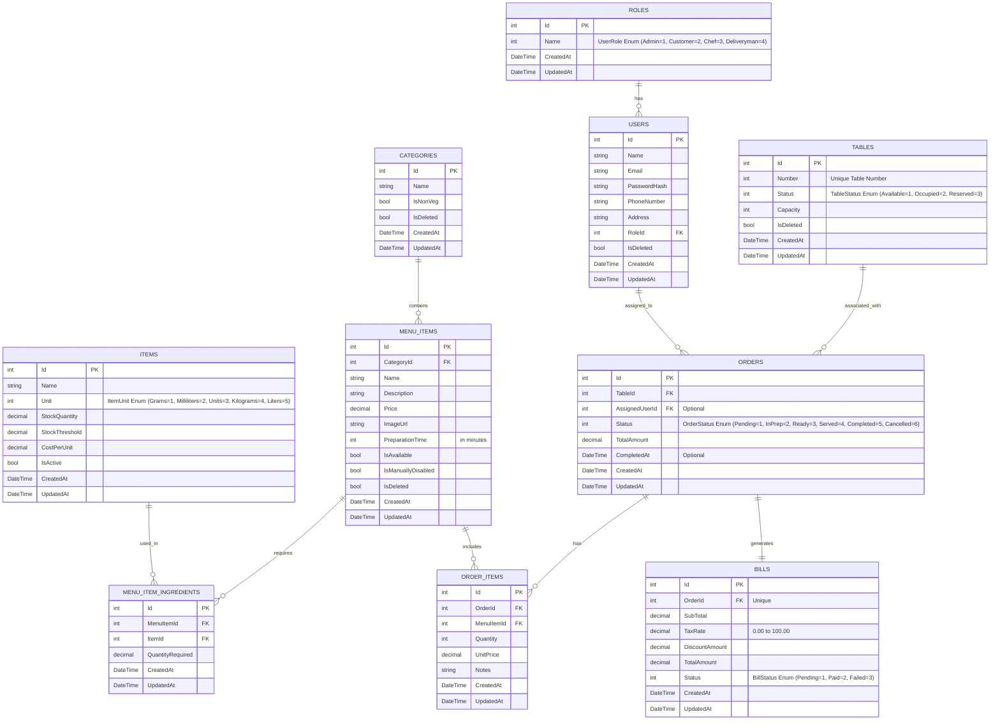

# Entity-Relationship (ER) Diagram

This document illustrates the Entity-Relationship schema for the **Order & Kitchen Management System**, utilizing a Mermaid diagram and field explanations.

## Mermaid ER Diagram

## Entity Descriptions

### 1. Roles
Defines the authorization role levels inside the system.
* **Id**: Primary Key (1 = Admin, 2 = Customer, 3 = Chef, 4 = Deliveryman).
* **Name**: `UserRole` enum representing the name of the role.

### 2. Users
User accounts for customers, admins, chefs, and delivery personnel.
* **RoleId**: Foreign Key mapping to the `Roles` table.
* **IsDeleted**: Soft deletion flag.

### 3. Tables
Physical dining tables available in the restaurant.
* **Number**: Unique number assigned to the table.
* **Status**: `TableStatus` enum indicating whether the table is Available (1), Occupied (2), or Reserved (3).

### 4. Categories
Food/drink classification categories (e.g., Starters, Main Course, Beverages).
* **IsNonVeg**: Boolean helper flag to distinguish vegetarian categories from non-vegetarian categories.

### 5. MenuItems
Dishes and drinks listed on the menu.
* **IsAvailable**: Computed availability based on ingredient stock.
* **IsManuallyDisabled**: Chef or Admin manual toggle to make a dish unavailable.

### 6. Items
Raw inventory items/ingredients (e.g., Flour, Milk, Eggs, Chicken) used to make menu items.
* **Unit**: `ItemUnit` enum for raw stock (Grams, Milliliters, etc.).
* **StockQuantity**: Real-time remaining stock of the ingredient.
* **StockThreshold**: Reorder limit; triggers low-stock alerts.

### 7. MenuItemIngredients
The recipe map that links menu items to raw inventory ingredients.
* **QuantityRequired**: The numeric decimal value of the ingredient consumed when one portion of the menu item is ordered.

### 8. Orders
Table orders placed by customers or waitstaff.
* **Status**: `OrderStatus` tracking (Pending, InPrep, Ready, Served, Completed, Cancelled).
* **TotalAmount**: Running sum of the ordered item prices.

### 9. OrderItems
Individual items requested in an order.
* **Quantity**: Amount ordered.
* **Notes**: Special cooking/service instructions.

### 10. Bills
Billing invoices generated when an order status reaches `Ready`.
* **TotalAmount**: Calculated formula: `SubTotal * (1 + TaxRate/100) - DiscountAmount`.
* **Status**: `BillStatus` tracking (Pending, Paid, Failed).
