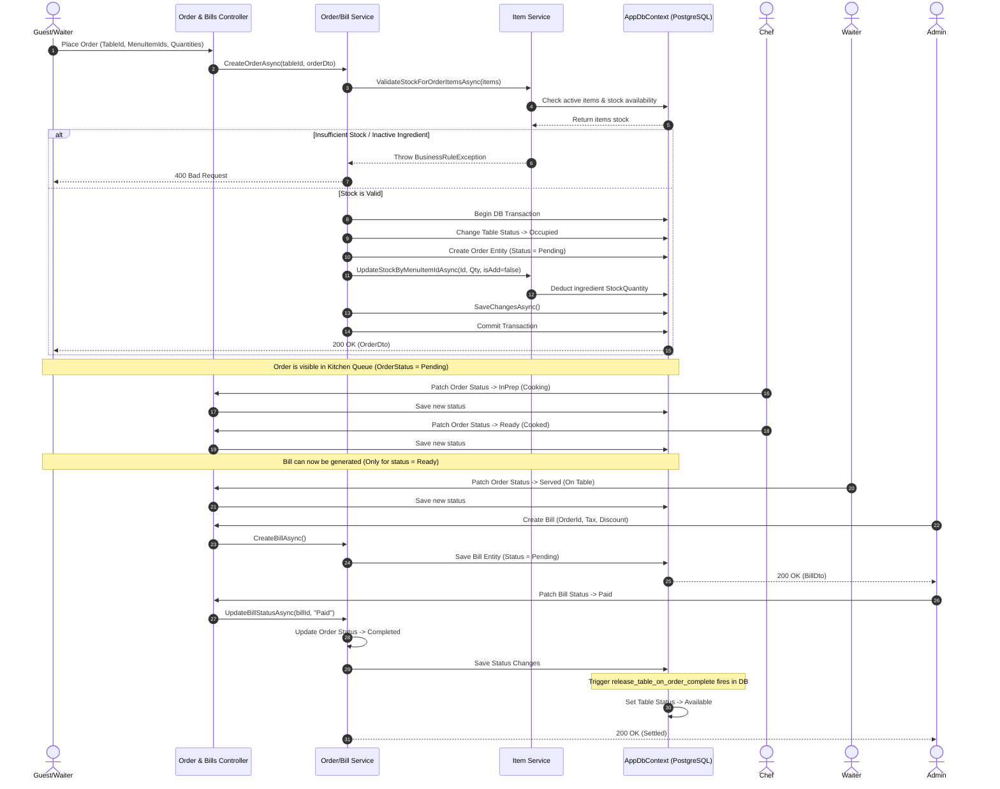
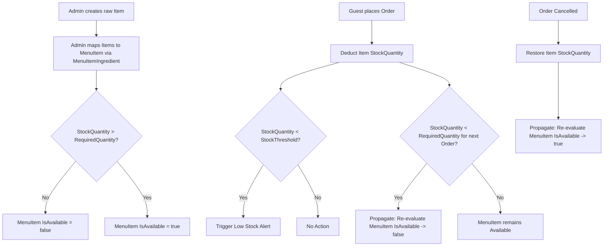
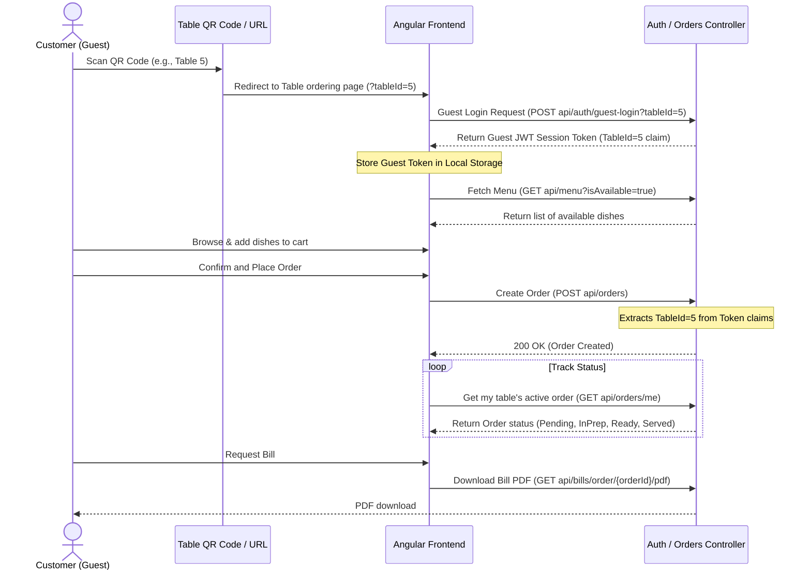
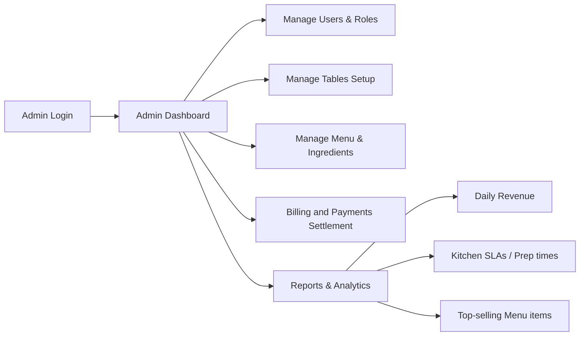

# Main System Workflows

This document maps out the core business workflows of the **Order & Kitchen Management System**.

---

## 1. Core Order Lifecycle Workflow

The following sequence diagram illustrates the lifecycle of a dining table order from creation to payment, highlighting stock changes and state transitions.

### Order Item Modifications & Cancellations
* **Adding Items**: Done while the order is `Pending`. Calls `AddOrderItemsAsync()`, validates stock, deducts stock for new items, and increases the order's `TotalAmount`.
* **Removing Items**: Done while the order is `Pending`. Calls `RemoveOrderItemAsync()`, restores stock, deletes the item, and subtracts from the order's `TotalAmount`.
* **Cancellation**: If an order is cancelled (`Status = Cancelled`) while `Pending` or `InPrep`, the `OrderService` iterates over all ordered items and calls `UpdateStockByMenuItemIdAsync(..., isAdd=true)` to restore ingredient quantities.

---

## 2. Stock and Inventory Workflow

The inventory system manages raw ingredients (e.g., flour, milk, chicken) and maps them to menu items.

### Key Behaviors:
1. **Low-Stock Alerts**: When an item's `StockQuantity` falls below its `StockThreshold`, it shows in the `/items/low-stock` endpoint.
2. **Propagated Availability Check**: When stock values change (during ordering, restocking, item updates), all menu items mapping to that ingredient are re-evaluated. If any mapped ingredient is insufficient or deactivated, the `MenuItem`'s `IsAvailable` flag is set to `false`.

---

## 3. Guest Flow

This flow allows restaurant customers to scan a table QR code and interact with the ordering system anonymously.

---

## 4. Admin Flow

Administrators manage system configuration and monitor performance.

* **User Management**: Creating and updating accounts for Chefs, Waiters, or Admins.
* **Table Setup**: Modifying the table numbers, capacities, or soft-deleting unused tables.
* **Menu Adjustments**: Adding new menu items, updating pricing, and manually overriding availability using `IsManuallyDisabled`.
