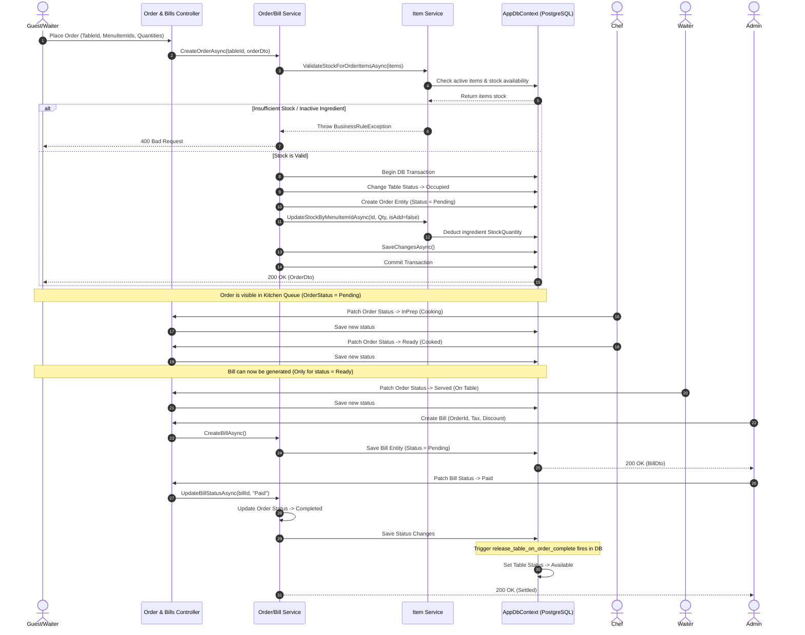
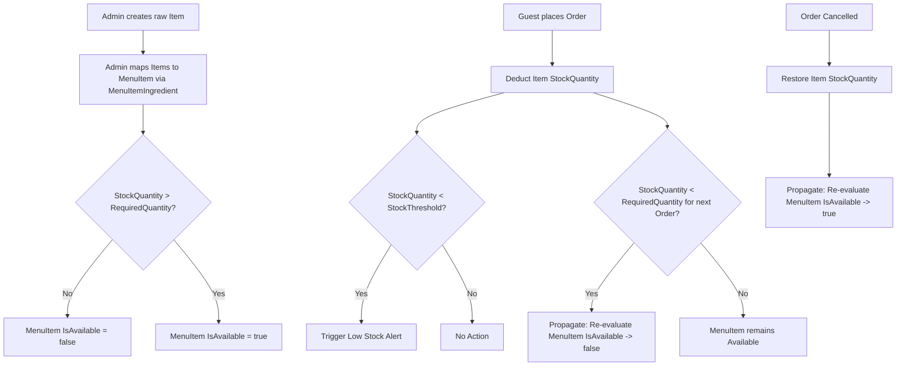
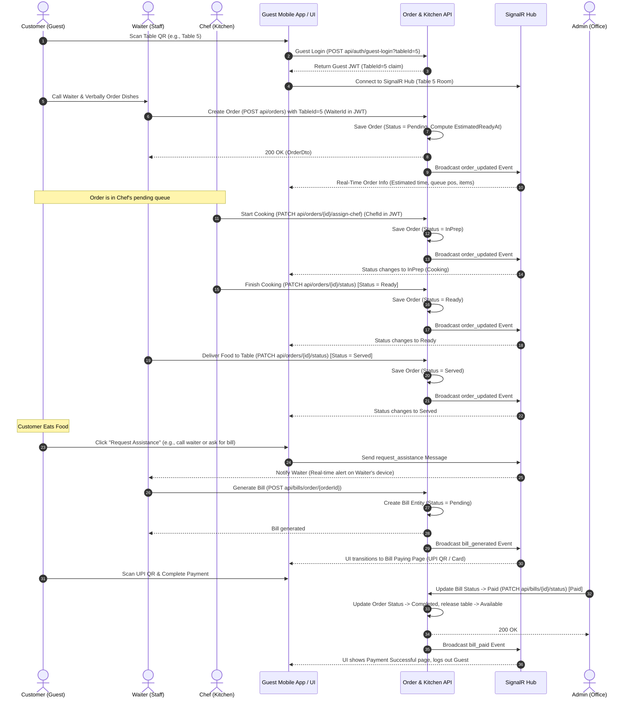
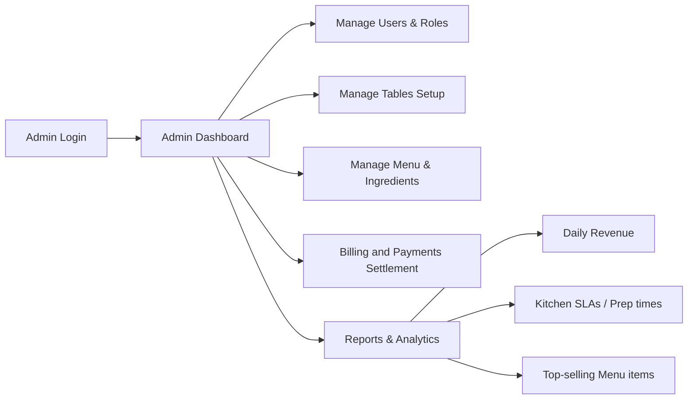

# Main System Workflows

This document maps out the core business workflows of the **Order & Kitchen Management System**.

---

## 1. Core Order Lifecycle Workflow

The following sequence diagram illustrates the lifecycle of a dining table order from creation to payment, highlighting stock changes and state transitions.

### Order Item Modifications & Cancellations
* **Adding Items**: Done while the order is `Pending`. Calls `AddOrderItemsAsync()`, validates stock, deducts stock for new items, and increases the order's `TotalAmount`.
* **Removing Items**: Done while the order is `Pending`. Calls `RemoveOrderItemAsync()`, restores stock, deletes the item, and subtracts from the order's `TotalAmount`.
* **Cancellation**: If an order is cancelled (`Status = Cancelled`) while `Pending` or `InPrep`, the `OrderService` iterates over all ordered items and calls `UpdateStockByMenuItemIdAsync(..., isAdd=true)` to restore ingredient quantities.

---

## 2. Stock and Inventory Workflow

The inventory system manages raw ingredients (e.g., flour, milk, chicken) and maps them to menu items.

### Key Behaviors:
1. **Low-Stock Alerts**: When an item's `StockQuantity` falls below its `StockThreshold`, it shows in the `/items/low-stock` endpoint.
2. **Propagated Availability Check**: When stock values change (during ordering, restocking, item updates), all menu items mapping to that ingredient are re-evaluated. If any mapped ingredient is insufficient or deactivated, the `MenuItem`'s `IsAvailable` flag is set to `false`.

---

## 3. Guest & Waiter Interaction Flow (Updated)

In this revised model, **Guest Sessions** are read-only and restricted to live food tracking and requesting assistance, while the **Waiter** handles order placement and modifications. Real-time updates are pushed dynamically to the Guest UI using SignalR.

---

## 4. Admin Flow

Administrators manage system configuration and monitor performance.

* **User Management**: Creating and updating accounts for Chefs, Waiters, or Admins.
* **Table Setup**: Modifying the table numbers, capacities, or soft-deleting unused tables.
* **Menu Adjustments**: Adding new menu items, updating pricing, and manually overriding availability using `IsManuallyDisabled`.

---

## 5. Core Stability & Unique Features

The system implements several unique mechanisms to ensure business logic consistency, billing fairness, and database safety:

### Strict Status Transition Lock
Order status updates follow a strictly enforced chain: `Pending` $\rightarrow$ `In Prep` (Cooking) $\rightarrow$ `Ready` $\rightarrow$ `Served` $\rightarrow$ `Completed`.
The system blocks arbitrary jumps (e.g. going from `Pending` straight to `Completed`, which would bypass the kitchen completely). Cancellations are also guarded and only allowed for orders that have not yet been finalised.

### Transaction-Safe Atomic Stock Protection
To prevent multiple parallel orders from "double-selling" the same raw ingredients when stock is low, ingredient deduction is performed as a single-operation database query. This ensures that stock is updated atomically; if another order deducts the last of an ingredient a millisecond earlier, the simultaneous order will immediately fail with a stock error instead of causing negative inventory.

### Price Lock Protection (Historical Billing)
To ensure customer trust, the price of each item is snapshot and saved on the order at the moment of placement. If an admin updates a menu item's price in the system while a guest is dining, the guest's final bill is calculated using the original prices from their order snapshot rather than the updated menu prices.

### Other Unique Features
* **Auto-Release Table on Payment**: Automatically frees table resources immediately when a bill is paid.
* **Propagated Availability Check**: Auto-updates menu availability whenever stock quantities or recipe ingredients change.
* **Real-time Room Broadcasting**: Pushes instant state updates to guests, waiters, and chefs.
* **Estimated Ready Time Calculator**: Computes preparation times dynamically using active queue position.
* **Table-Bound Session Security**: Restricts guest tokens to accessing details only for their specific table.
* **Low-Stock Alerting**: Proactively flags ingredients when stock drops below threshold values.
* **Soft-Delete Safety Guards**: Retains database reference integrity by soft-deleting entities.
